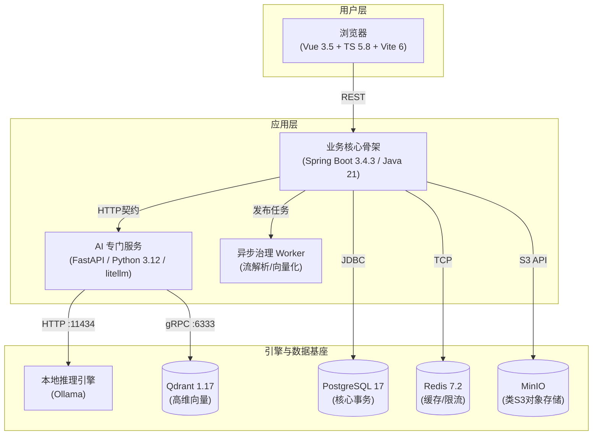
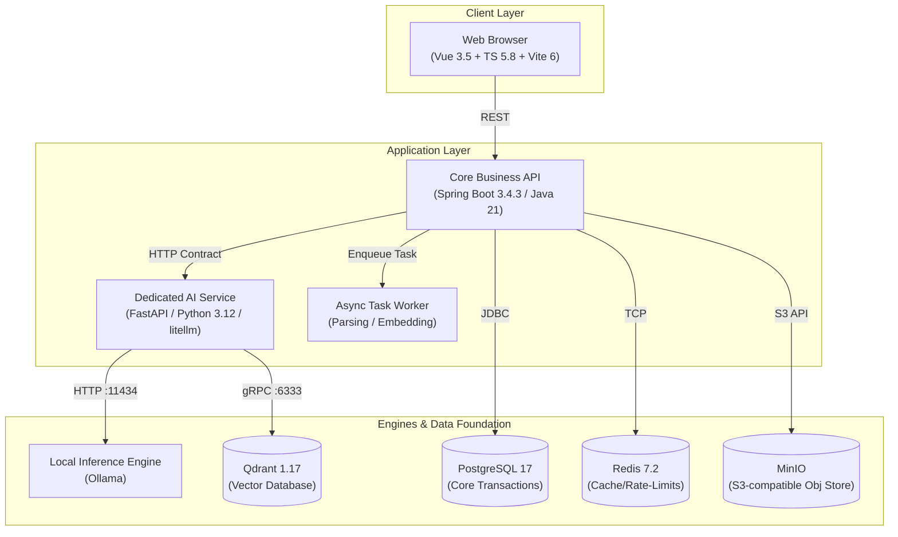

# EduNexus AI

[🌍 English Version](#english-version) | [🇨🇳 中文版](#中文版)

---

<span id="中文版"></span>
# 🎓 EduNexus AI (中文版)


**EduNexus AI** 是一个面向高校实训场景的现代化、智能化 AI 学习赋能平台。项目致力于打破传统教育的信息孤岛，通过大语言模型（LLM）与检索增强生成（RAG）技术，在学生、教师和管理者之间形成**“学-练-评-教-管”**的完整业务闭环。

本级项目严格遵循 **“单一事实来源（SSOT）”** 的工程治理规范，追求企业级的高可维护性、高可测试性与代码规范。

## ✨ 核心特性

### 👨‍🎓 学生端 (Student)
- **智能伴学对话 (RAG-based Chat)**：基于教师专属知识库的 AI 问答，支持流式输出与精确到文档片段的来源引用（Citations），告别“AI 幻觉”。
- **智能化练习与错题本**：支持自动判分、知识点提取与错误成因分析。错题自动收录并根据掌握情况动态移除。
- **AI 个性化出题**：AI 结合学生薄弱点（错题画像）与教师建议，动态生成贴合当前学习进度的专属练习题。

### 👨‍🏫 教师端 (Teacher)
- **私有知识库摄取 (Knowledge Pipeline)**：支持一键上传 PDF/Word 文档。系统采用异步任务进行自动解析、智能切片与高维空间向量化（Embedding）。
- **AI 智能教案生成**：输入核心主题与课时，极速生成结构化、支持 Markdown/PDF 导出与临时链接分享的教案。
- **学情分析与干预**：可视化跟踪班级学生的错题重灾区，提供定点建议直达学生解析面板。

### 🛡️ 管理与平台工程 (Admin & Platform)
- **智能模型路由机制 (Model Routing)**：根据场景复杂度自动回退与分发策略。轻量级任务走本地 `qwen3`，深度推理任务走 `deepseek-r1`，具备高可用降级能力。
- **严格权限隔离 (RBAC+ABAC)**：基于角色与资源归属、师生绑定关系的多维度数据隔离，确保数据隐私绝对安全。

## 🏗️ 架构设计

项目采用轻量化微服务/单体混合架构设计，业务与 AI 推理服务严格解耦。



## 🛠️ 技术栈清单

- **前端 (Frontend)**: Vue 3.5, TypeScript 5.8, Vite 6, Pinia, Vue Router, Element Plus, Tailwind/CSS Variables.
- **后端 (Backend)**: Java 21, Spring Boot 3.4.3, JdbcTemplate, Flyway, Virtual Threads.
- **AI 算法与服务 (AI Service)**: Python 3.12, FastAPI 0.116, Uvicorn, litellm.
- **数据中间件 (Data & Infrastructure)**: PostgreSQL 17, Redis 7.2, Qdrant 1.17, MinIO.
- **大模型 (LLMs)**: qwen3-embedding:0.6b, qwen3:4b/8b, deepseek-r1:8b (均可基于 Ollama 本地化部署，支持无缝切换至云端 API).

## 🚀 快速启动

### 1. 环境准备
- 确保系统已安装 **Docker** 与 **Docker Compose**。
- 确保已安装 JDK 21 和 Node.js 20+。
- ⚠️ **强制要求**：Python 环境**必须**使用 [Conda](https://docs.conda.io/en/latest/)，且环境名必须为 `edunexus-ai`。
- ⚠️ **强制要求**：Python 依赖管理与执行**必须**使用 [uv](https://docs.astral.sh/uv/)。

### 2. 构建与运行基础设施
```bash
# 启动 PG, Redis, Qdrant, MinIO 等底层依赖
docker-compose up -d
```

### 3. 配置环境变量
复制 `.env.example` 为 `.env` 并按需调整配置（特别是数据库密码与外部模型 API 密钥）。

### 4. 启动 AI 服务 (Python)
```bash
# 创建并激活专用 Conda 环境
conda create -n edunexus-ai python=3.12 -y
conda activate edunexus-ai

# 使用 uv 同步依赖并启动服务
uv sync --project apps/ai-service 
uv run --project apps/ai-service uvicorn ai_service.app:app --host 0.0.0.0 --port 8000
```

### 5. 启动核心业务骨架与前端
```bash
# 启动 Spring Boot (apps/api目录)
./mvnw spring-boot:run

# 启动 Vue 前端 (apps/web目录)
npm install
npm run dev
```

## 📚 查阅官方文档

本项目拥有顶级的单一事实来源（SSOT）工程化文档支持，请在 `doc/` 目录下查阅全部设计规范：

- 核心架构与规则：[`00-SSOT-总则.md`](./doc/00-SSOT-总则.md)
- 业务需求边界：[`01-PRD-产品需求规格.md`](./doc/01-PRD-产品需求规格.md)
- 数据与向量建模：[`05-数据模型与迁移规范.md`](./doc/05-数据模型与迁移规范.md)
- API 交互契约：[`06-API契约-openapi.yaml`](./doc/06-API契约-openapi.yaml)
- 智能问答与提示词管理：[`08-AI与RAG策略.md`](./doc/08-AI与RAG策略.md)

---

<span id="english-version"></span>
# 🎓 EduNexus AI (English Version)


**EduNexus AI** is a modernized, AI-empowered educational platform tailored for higher education and practical training scenarios. By integrating Large Language Models (LLMs) and Retrieval-Augmented Generation (RAG) capabilities, the platform completely bridges the information gap between students, educators, and administrators, forming a closed-loop ecosystem of **"Learn - Practice - Evaluate - Teach - Manage"**.

The repository strictly adheres to the **"Single Source of Truth (SSOT)"** engineering governance standards, aiming for enterprise-grade maintainability, extreme testability, and rigid code consistency.

## ✨ Key Features

### 👨‍🎓 For Students
- **Smart RAG-based Chat Tutor**: Converse with an AI backed by teachers' private knowledge bases. Features streaming responses and precise artifact citations to thoroughly eliminate AI hallucinations.
- **Intelligent Exercise & Wrong-Book**: Automated grading, knowledge point extraction, and root-cause analysis for mistakes. Incorrect answers automatically populate an interactive "wrong-book" that prunes itself based on mastery levels.
- **Personalized AI Question Generation**: Dynamically spins up relevant practice questions targeted exactly at the student's weakness profiles and specific teacher suggestions.

### 👨‍🏫 For Teachers
- **Private Knowledge Ingestion**: Seamless one-click uploads for PDFs/Word documents. Triggers asynchronous background jobs for text parsing, semantic chunking, and high-dimensional space embedding.
- **AI Lesson Plan Generation**: Instantly generate structured, pedagogically sound lesson plans based on core topics and durations. Supports Markdown/PDF exports and secure sharing via expirable links.
- **Analytics & Intervention**: Visually track class-wide struggling points and push personalized suggestions directly into a student's exercise evaluation flow.

### 🛡️ For Admins & Platform Integrity
- **Smart Model Routing**: Scenario-based automated fallback and dispatching. Lightweight routing goes to local `qwen3`, deep reasoning routes to `deepseek-r1`, with high-availability fallbacks to cloud providers.
- **Strict Authorization Bounds (RBAC+ABAC)**: Multi-dimensional data isolation driven by user roles, resource ownership, and verified teacher-student rosters ensures absolute data privacy.

## 🏗️ Architecture Design

The project adopts a lightweight hybrid microservices/monolith design, strictly decoupling the core transactional business logic from the heavy AI inference services.



## 🛠️ Tech Stack

- **Frontend**: Vue 3.5, TypeScript 5.8, Vite 6, Pinia, Vue Router, Element Plus, Tailwind/CSS Variables.
- **Backend API**: Java 21, Spring Boot 3.4.3, JdbcTemplate, Flyway, Virtual Threads.
- **AI Algorithms & Service**: Python 3.12, FastAPI 0.116, Uvicorn, litellm.
- **Data & Middleware**: PostgreSQL 17, Redis 7.2, Qdrant 1.17, MinIO.
- **LLM Fleet**: qwen3-embedding:0.6b, qwen3:4b/8b, deepseek-r1:8b (All deployable locally via Ollama with seamless fallback to Cloud APIs).

## 🚀 Quick Start

### 1. Prerequisites
- Ensure **Docker** and **Docker Compose** are installed and running.
- Ensure **JDK 21** and **Node.js 20+** are installed.
- ⚠️ **MANDATORY**: The Python environment **MUST** be provisioned via [Conda](https://docs.conda.io/en/latest/), and the environment name **MUST** be `edunexus-ai`.
- ⚠️ **MANDATORY**: Python dependency management and script execution **MUST** use [uv](https://docs.astral.sh/uv/).

### 2. Stand up Infrastructure Hub
```bash
# Boot PG, Redis, Qdrant, MinIO, etc.
docker-compose up -d
```

### 3. Environment Variable Configuration
Copy `.env.example` to `.env` and adjust your variables accordingly (Especially DB passwords and external LLM keys).

### 4. Boot up the AI Service (Python)
```bash
# Create and activate the mandatory Conda environment
conda create -n edunexus-ai python=3.12 -y
conda activate edunexus-ai

# Use uv to sync dependencies and run the server
uv sync --project apps/ai-service 
uv run --project apps/ai-service uvicorn ai_service.app:app --host 0.0.0.0 --port 8000
```

### 5. Boot Core API and Frontend
```bash
# Start Spring Boot (inside apps/api)
./mvnw spring-boot:run

# Start Vue Client (inside apps/web)
npm install
npm run dev
```

## 📚 Official Documentation

This repository prides itself on its premier Single Source of Truth (SSOT) engineering docs. Please find the comprehensive system constraints inside the `doc/` folder:

- Core Directives & Architecture: [`00-SSOT-总则.md`](./doc/00-SSOT-总则.md)
- Product Requirements (PRD): [`01-PRD-产品需求规格.md`](./doc/01-PRD-产品需求规格.md)
- Relational & Vector Data Models: [`05-数据模型与迁移规范.md`](./doc/05-数据模型与迁移规范.md)
- REST API Contracts: [`06-API契约-openapi.yaml`](./doc/06-API契约-openapi.yaml)
- Pipeline & Generation Prompt Specs: [`08-AI与RAG策略.md`](./doc/08-AI与RAG策略.md)

---
*Powered by EduNexus AI Team | 2026 Edition*
