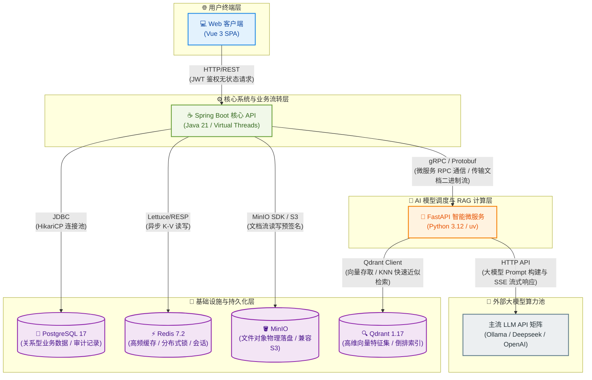

# EduNexus AI

[](https://github.com/hicancan/edunexus-ai)
[](https://github.com/hicancan/edunexus-ai)
[](https://github.com/hicancan/edunexus-ai)
[](https://openjdk.org/projects/jdk/21/)
[](https://www.python.org/downloads/release/python-3120/)
[](./LICENSE)

EduNexus AI 是一个面向学生、教师、管理员三类角色的一体化教育工作台。它将**智能问答、练习判卷、AI 出题、知识库维护、教案生成、学情分析、教师干预建议、资源治理和审计追踪**整合入统一平台，完整覆盖“学习 -> 教学 -> 管理”全链路。

## 项目目标与角色闭环

- **👨‍🎓 学生侧闭环**：围绕知识检索、练习、错题、AI 个性化出题和个人数字画像形成学习闭环。
- **👩‍🏫 教师侧闭环**：围绕文档入库、智能化结构教案生成、学情洞察和针对性干预建议下发形成教学支持闭环。
- **🛡️ 管理侧闭环**：围绕账号治理、系统资源治理、流式指标看板和系统审计日志形成平台运维闭环。

---

## 核心架构设计

本项目采用**前后端分离 + 领域驱动设计 (DDD/简化版) + AI 微服务架构**，确保各职责模块的高内聚与低耦合。


```mermaid
graph TB
    %% 样式与主题定义
    classDef client fill:#e3f2fd,stroke:#1e88e5,stroke-width:2px,color:#0d47a1
    classDef api fill:#f1f8e9,stroke:#689f38,stroke-width:2px,color:#33691e
    classDef ai fill:#fff3e0,stroke:#f57c00,stroke-width:2px,color:#e65100
    classDef db fill:#f3e5f5,stroke:#8e24aa,stroke-width:2px,color:#4a148c
    classDef external fill:#eceff1,stroke:#607d8b,stroke-width:2px,color:#263238

    subgraph client_tier [🌐 用户终端层]
        Client["💻 Web 客户端<br/>(Vue 3 SPA)"]:::client
    end

    subgraph business_tier [⚙️ 核心系统与业务流转层]
        API["☕ Spring Boot 核心 API<br/>(Java 21 / Virtual Threads)"]:::api
    end

    subgraph ai_tier [🧠 AI 模型调度与 RAG 计算层]
        AI["🐍 FastAPI 智能微服务<br/>(Python 3.12 / uv)"]:::ai
    end

    subgraph infrastructure_tier [💾 基础设施与持久化层]
        PG[("🐘 PostgreSQL 17<br/>(关系型业务数据 / 审计记录)")]:::db
        Redis[("⚡ Redis 7.2<br/>(高频缓存 / 分布式锁 / 会话)")]:::db
        MinIO[("🪣 MinIO<br/>(文件对象物理落盘 / 兼容S3)")]:::db
        Qdrant[("🔍 Qdrant 1.17<br/>(高维向量特征集 / 倒排索引)")]:::db
    end

    subgraph llm_tier [🤖 外部大模型算力池]
        LLM["主流 LLM API 矩阵<br/>(Ollama / Deepseek / OpenAI)"]:::external
    end

    %% 分层通信链路与协议说明
    Client -- "HTTP/REST<br/>(JWT 鉴权无状态请求)" --> API

    API -- "JDBC<br/>(HikariCP 连接池)" --> PG
    API -- "Lettuce/RESP<br/>(异步 K-V 读写)" --> Redis
    API -- "MinIO SDK / S3<br/>(文档流读写预签名)" --> MinIO

    API -- "gRPC / Protobuf<br/>(微服务 RPC 通信 / 传输文档二进制流)" --> AI

    AI -- "Qdrant Client<br/>(向量存取 / KNN 快速近似检索)" --> Qdrant
    AI -- "HTTP API<br/>(大模型 Prompt 构建与 SSE 流式响应)" --> LLM
```

---

## 技术栈与基础设施

该项目坚持使用前沿且稳定的技术栈构建：

### 🎨 前端架构 (`apps/web`)

- 核心框架：**Vue 3.5** + **Composition API**
- 语言基座：**TypeScript 5**
- 构建工具：**Vite 6**
- 状态管理：**Pinia**
- UI 组件库：**Naive UI** (定制化 Glassmorphism 毛玻璃主题)
- 数据可视化：**ECharts** + **Vue-ECharts**
- 工程化规范：**ESLint 9 (Flat Config)** + **Prettier** + **Vitest**

### ☕ 核心后端 (`apps/api`)

- 核心框架：**Spring Boot 3.4** + **Java 21** (利用 Virtual Threads)
- 安全认证：**Spring Security** + **JWT** 鉴权体系
- 数据持久化：**Spring Data JDBC** (避开臃肿的 JPA)
- 数据库版本控释：**Flyway**
- 接口契约：**OpenAPI / SpringDoc** (契约驱动，生成 TS 类型)
- 微服务通信：**gRPC + Protobuf** 协议
- 工程化规范：**Maven** + **Spotless (Google Java Format)**

### 🧠 智能服务 (`apps/ai-service`)

- 核心架构：**FastAPI** + **Python 3.12**
- AI/RAG 集成：
  - 本地优先大语言模型路由（支持 Ollama / Deepseek / OpenAI / Gemini 动态切换）
  - Qdrant 官方客户端进行高维向量检索
  - 智能文件解析提取 (pypdf, python-docx)
- 依赖管理：**uv** (极速 Python 包与环境管理)
- 工程化规范：**Ruff** (超快 Linter & Formatter), **Pytest**

### 🐳 本地基础设施调度 (`docker-compose.yml`)

- 数据库：**PostgreSQL 17**
- 缓存/消息：**Redis 7.2**
- 向量库：**Qdrant 1.17**
- 对象存储：**MinIO (兼容 S3)**

---

## 页面总览与功能拓扑

当前前端路由共设有 **18** 个功能页面，权限彼此严格隔离：

### 🚪 公共入口页

- `/login`：统一认证入口，支持根据角色登录后自动路由。
- `/register`：包含用户名、邮箱、角色的综合注册面板。
- `/403` / `/404`：标准权限拦截与路由丢失兜底。

### 🎓 学生工作区

- **代码路由**：`/student/*`
- **核心页面**：
  1. `智能问答 (/chat)`：支持上下文对话，通过 RAG 技术连接班级知识库。
  2. `练习大厅 (/exercise)`：支持多学科难度组合，进行无缝单/多选/简答作答。
  3. `做题记录 (/records)`：历史轨迹回溯与云端解析回顾。
  4. `错题本 (/wrong-book)`：错题薄强化，支持“标记掌握”闭环操作。
  5. `AI 个性化出题 (/ai-questions)`：基于知识盲区主动调用大模型产出新题。
  6. `学情画像 (/profile)`：数据雷达图呈现。

### 📋 教师工作区

- **代码路由**：`/teacher/*`
- **核心页面**：
  1. `知识库管理 (/knowledge)`：核心 RAG 数据源输入口，支持多格式解析与切片管理。
  2. `教案管理 (/plans)`：引导大模型依据教育大纲产出结构化授课教案。
  3. `全盘学情分析 (/analytics)`：从班级宏观维度分析学生的错题率与易错知识点。
  4. `干预建议与下发 (/suggestions)`：结合大模型的建议流自动分配给学生主页。

### ⚙️ 管理员操作台

- **代码路由**：`/admin/*`
- **核心页面**：
  1. `用户管理 (/users)`：平台角色的审查与封禁解封。
  2. `资源审计 (/resources)`：追踪 MinIO 底层的真实物理存储分布与利用率。
  3. `流式数据看板 (/dashboard)`：实时掌控系统的调用规模、吞吐及 API 开销。
  4. `合规审计日志 (/audits)`：溯源敏感操作，落实系统合规性。

---

## 代码风格与持续集成 (CI) 统一规范

本项目秉承 **"Best Practices & Top-tier Design"** 理念，建立了一套强制的自动化代码校验流程，保障所有语言风格高度对齐。

### 1. 规约与工具矩阵

| 模块          | 校验工具                | 核心规则描述                                                                                                                   |
| ------------- | ----------------------- | ------------------------------------------------------------------------------------------------------------------------------ |
| **Web 前端**  | `ESLint 9` + `Prettier` | 遵循 Vue 3 Recommended，剔除未使用变量 (`no-unused-vars` 阻塞或警告)，严格 100 字符行宽限定。                                  |
| **API 服务**  | `Spotless`              | 强制使用 **Google Java Format** 标准风格，自动移除死导入，严格 LF 换行。                                                       |
| **AI 微服务** | `Ruff`                  | 远超基础 PEP8。开启了 `S` (安全)、`PT` (Pytest 语法)、`SIM` (代码简化规则) 等深度检查，拒绝任何魔法硬编码 (Hardcoded Tokens)。 |
| **基础文件**  | `.editorconfig`         | 在 IDE 层面强制保障所有端 2/4 空格进位以及无尾随空格现象。                                                                     |

### 2. 本地快速校验命令

我们在根目录 `/scripts` 提供了全栈格式化流水线钩子：

**一键格式化全栈代码 (Format All)**

```powershell
pwsh -NoProfile -File .\scripts\format-all.ps1
```

**一键审查全栈代码合规性 (Check Only)**

```powershell
pwsh -NoProfile -File .\scripts\format-check.ps1
```

### 3. GitHub Actions CI 拦截网

我们为项目部署了严苛的 CI 屏障 (`.github/workflows/ci.yml`)，拦截不合规的 Pull Request：

- **格式与静态扫描层**：`web-lint`, `api-format`, `ai-format`，外加 `gitleaks` (全库密钥泄露扫描)。
- **编译与类型校验层**：Vue 的 `web-typecheck` + Java 的单元测试编译。
- **服务测试用例层**：前端 Vitest (`web-test`) + Python Pytest (`ai-test`) 无缝结合。

---

## 快速运行与环境部署

### 1. 前置依赖项

> 在开始前，请核对您的开发环境。

- **Docker Desktop** (用于拉起存储及数据库)
- **Java 21 JDK**
- **Node.js 20+** (LTS)
- **Python 3.12+**
- **uv** (推荐 `pip install uv` 安装)
- **Maven 3.9+**

### 2. 点火启动

1. 初始化环境变量 (首次部署必要步骤)
   ```powershell
   Copy-Item .env.example .env
   ```
2. 运行一键联调编排脚本
   ```powershell
   .\scripts\run-dev.ps1
   ```
   _(该脚本将自动验证 Docker 并行拉起 Postgres/Redis/MinIO/Qdrant，并于终端启动 SpringBoot 和 Web 端)_

### 3. 本地全链路冒烟测试

为确保各跨端微服务 (Vue -> SpringBoot -> gRPC -> Python) 的连通性，可执行回归脚本：

```powershell
pwsh -NoProfile -File .\scripts\regression-smoke.ps1
```

---

## 默认账号及端口指南

### 端口字典

| 服务名称                          | 默认端口映射            |
| --------------------------------- | ----------------------- |
| **Frontend Web** (Vite Server)    | `http://127.0.0.1:5173` |
| **Spring Boot API** (Core System) | `http://127.0.0.1:8080` |
| **Python AI Service** (FastAPI)   | `http://127.0.0.1:8000` |
| **MinIO Console** (对象存储面板)  | `http://127.0.0.1:9001` |

### 快捷测试账户

| 扮演角色      | 登录名      | 密码       |
| ------------- | ----------- | ---------- |
| 🛡️ 平台管理员 | `admin`     | `12345678` |
| 👨‍🏫 高级教师   | `teacher01` | `12345678` |
| 🎓 在读学生   | `student01` | `12345678` |

---

## 许可协议 (License)

本项目代码受到 **GNU Affero General Public License v3.0 (AGPL-3.0)** 的全面保护与开源许可。任何对于系统代码的修改部署和公网分发都必须遵从 AGPL-3.0 条例强制开源同等代码。
详情参阅仓库内的 [LICENSE](./LICENSE) 源文件。
