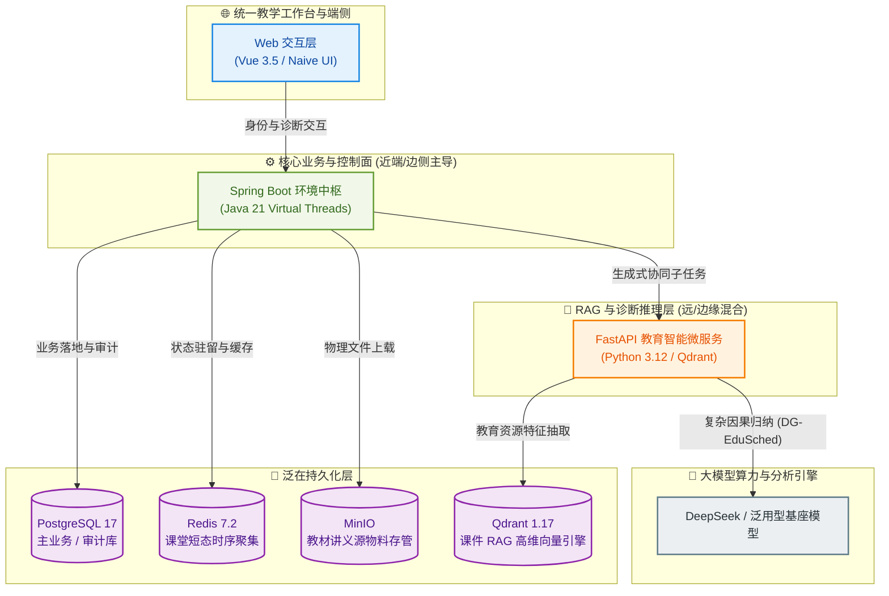
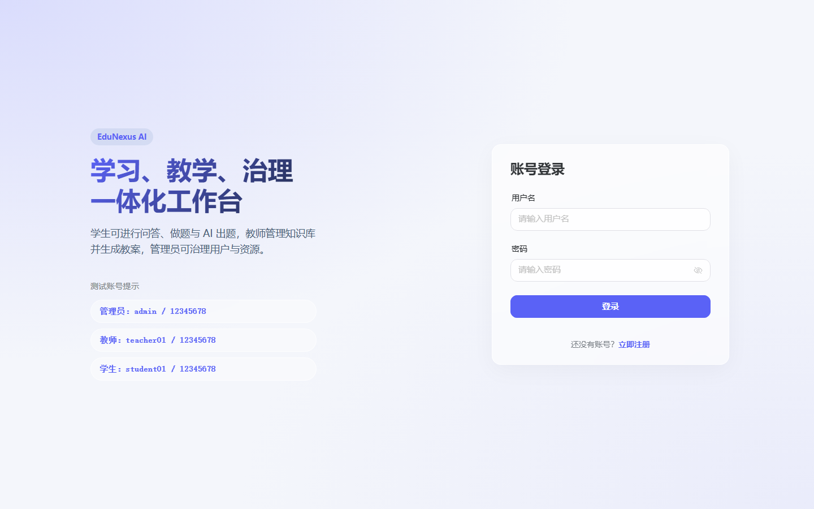
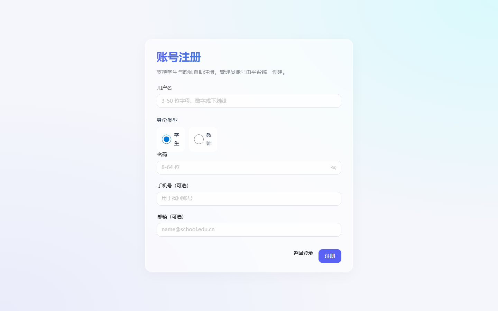
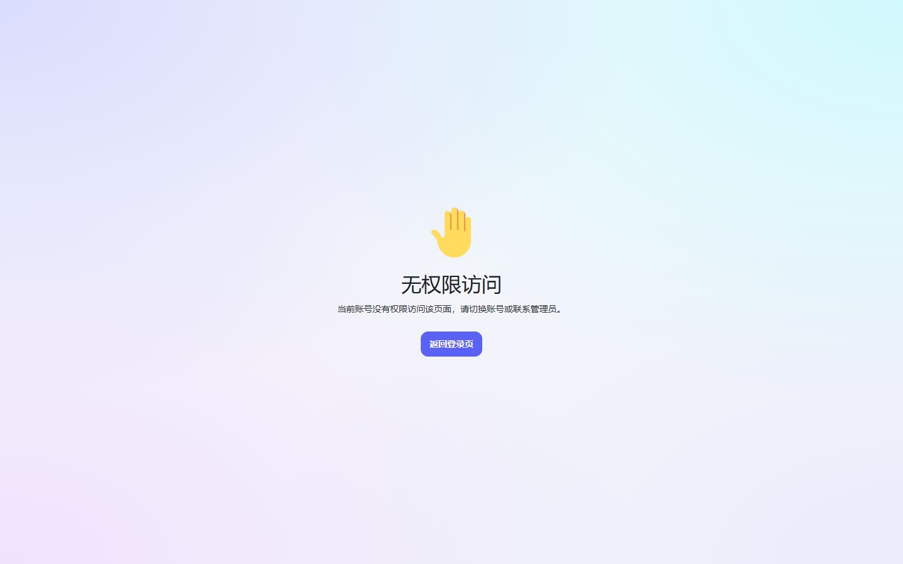
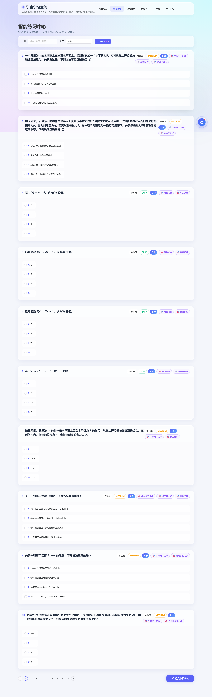
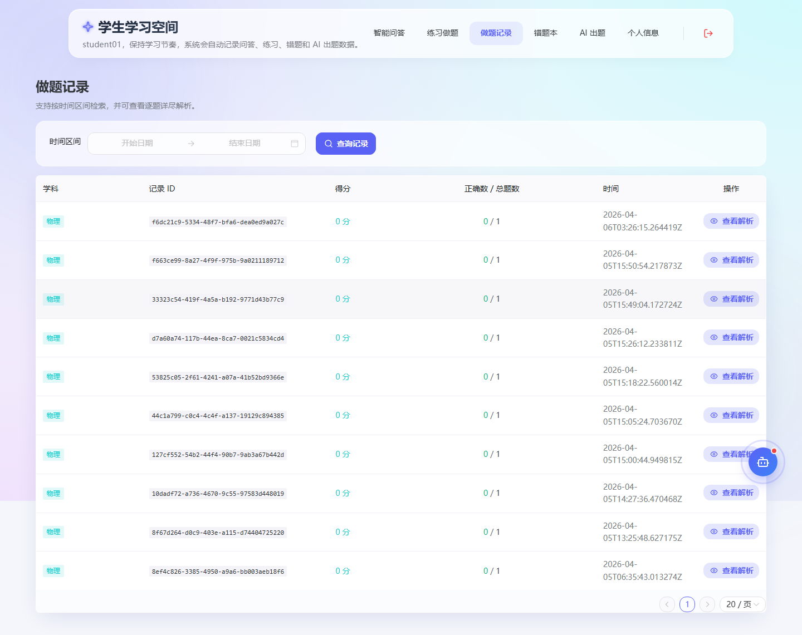
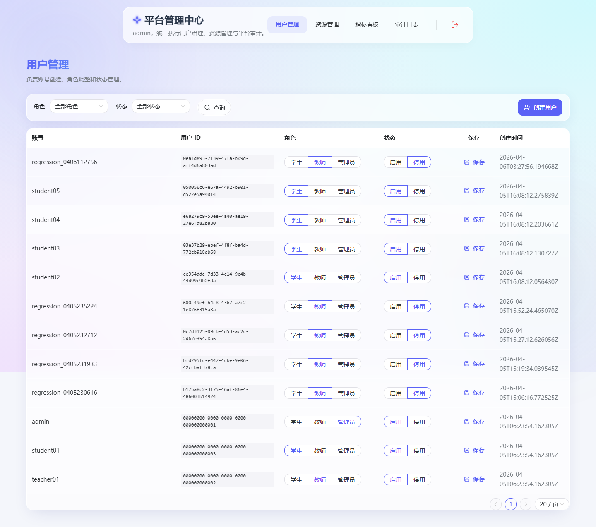
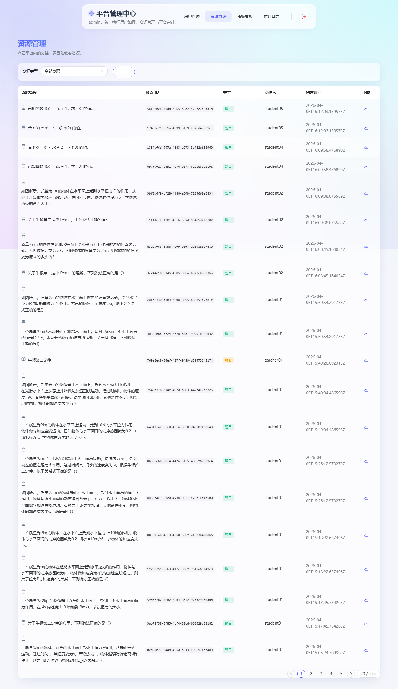

# EduNexus-AI：面向课堂即时诊断与个性化干预的云边端协同智能辅学系统

[](https://github.com/hicancan/edunexus-ai)
[](https://github.com/hicancan/edunexus-ai)
[](https://github.com/hicancan/edunexus-ai)
[](https://openjdk.org/projects/jdk/21/)
[](https://www.python.org/downloads/release/python-3120/)
[](./LICENSE)

EduNexus-AI 是一套以**“课堂即时诊断与个性化干预”**为核心构建的云边端协同智能辅学系统。它的设计理念超越了传统的“大模型试题库推荐”，全面跃升为**面向学习支持的形成性评价数字中枢**。系统以服务学生认知建构、问题暴露、学习调节与教师干预为导向，实现了教与学微观过程的完整闭环。

---

## 🎓 核心教育理念与系统亮点

本系统的研发逻辑植根于成熟的教育诊断与治理理论，以避免“唯 AI 论”导致的技术喧宾夺主：

- **Teacher-in-the-Loop（教师主导的干预机制）**：AI 在系统中只作为高频分析与初步诊断的前置模块。最核心的教学路线规划、知识预警与直接干预建议，必须受到主责教师的审阅与人工确认。这不仅规避了大模型产生幻觉的风险，也捍卫了复杂教育场景下的伦理规制。
- **时间敏感的动态画像建模**：抛弃了刻板的“高分生/薄弱生”静态属性标签，依托近端缓存计算，构建出对课堂内最后十分钟状态极度灵敏的“序列化学习特征”。抓住学生认知受阻的最关键窗口期，提供真正意义上的即时纠偏。
- **教育数据分治的“云边端协同”**：强隐私敏感度的个人识别、答题判定与高频交互拦截驻留在边端（Spring Boot + Redis）；而深度的教案撰写、跨用户共度错因大模型联合归因则调度至核心算力层。

---

## 🏗️ 架构底座与 DG-EduSched 调度引擎

为化解云侧大模型时延无法适配课堂极速诊断以及高敏隐私管控的痛点，系统底层构建了独创的**依赖感知任务图 (DG-EduSched)** 调度引擎。所有教育任务在此引擎的约束下，被智能拆分至异构计算层中执行。


```mermaid
graph TB
    %% 样式与主题定义
    classDef client fill:#e3f2fd,stroke:#1e88e5,stroke-width:2px,color:#0d47a1
    classDef api fill:#f1f8e9,stroke:#689f38,stroke-width:2px,color:#33691e
    classDef ai fill:#fff3e0,stroke:#f57c00,stroke-width:2px,color:#e65100
    classDef db fill:#f3e5f5,stroke:#8e24aa,stroke-width:2px,color:#4a148c
    classDef external fill:#eceff1,stroke:#607d8b,stroke-width:2px,color:#263238

    subgraph client_tier ["🌐 统一教学工作台与端侧"]
        Client["Web 交互层<br/>(Vue 3.5 / Naive UI)"]:::client
    end

    subgraph business_tier ["⚙️ 核心业务与控制面 (近端/边侧主导)"]
        API["Spring Boot 环境中枢<br/>(Java 21 Virtual Threads)"]:::api
    end

    subgraph ai_tier ["🧠 RAG 与诊断推理层 (远/边缘混合)"]
        AI["FastAPI 教育智能微服务<br/>(Python 3.12 / Qdrant)"]:::ai
    end

    subgraph infrastructure_tier ["💾 泛在持久化层"]
        PG[("PostgreSQL 17<br/>主业务 / 审计库")]:::db
        Redis[("Redis 7.2<br/>课堂短态时序聚集")]:::db
        MinIO[("MinIO<br/>教材讲义源物料存管")]:::db
        Qdrant[("Qdrant 1.17<br/>课件 RAG 高维向量引擎")]:::db
    end

    subgraph llm_tier ["🤖 大模型算力与分析引擎"]
        LLM["DeepSeek / 泛用型基座模型"]:::external
    end

    Client -- "身份与诊断交互" --> API
    API -- "业务落地与审计" --> PG
    API -- "状态驻留与缓存" --> Redis
    API -- "物理文件上载" --> MinIO
    API -- "生成式协同子任务" --> AI
    AI -- "教育资源特征抽取" --> Qdrant
    AI -- "复杂因果归纳 (DG-EduSched)" --> LLM
```

---

## 🎨 系统运行态全景：角色交互矩阵

系统的应用链路被彻底打穿，形成了以教师、学生和管理员三大角色为视角的生产环境闭环。

### 统一认证与基础容错

全新的一体化前置入口，支撑基于角色的精细化拦截与自适应引导。

|               统一登录入口                |                 用户快速注册                 |
| :---------------------------------------: | :------------------------------------------: |
|  |  |

|             无权限阻断拦截 (403)              |            未知页面优雅兜底 (404)            |
| :-------------------------------------------: | :------------------------------------------: |
|  |  |

### 学生侧：从提问到画像重构

学生可以直接进行基于教学范围的强关联闭卷问答、自动根据个人薄弱点针对出题的分层练习，以及深度剖析做题错误本质的智能错题本全生命周期管理。

|                智能问答与学案辅导                |                    学生自适应出题引擎                    |
| :----------------------------------------------: | :------------------------------------------------------: |
|  |  |

|               短板诊断画像与进度面板                |                 收敛错因的系统错题本                 |
| :-------------------------------------------------: | :--------------------------------------------------: |
|  |  |

|                   分层靶向练习实镜                   |                历次练习数据长效追溯                 |
| :--------------------------------------------------: | :-------------------------------------------------: |
|  |  |

### 教师侧：从资源灌缝到干预下发

教师可在后台对自有教学主材执行语义剥离进库进行知识隔离管理。通过即时查看全班错误聚合趋势，确证并直接下发系统前置给出的建议干预案。

|                 讲义语料 RAG 入库维护                 |            班级薄弱项预警与高频错误分析             |
| :---------------------------------------------------: | :-------------------------------------------------: |
|  |  |

|                体系化教案导出工具                 |              “教师在环”的建议下发确认面板               |
| :-----------------------------------------------: | :-----------------------------------------------------: |
|  |  |

### 骨干底座：全局治理与无缝审计

面向系统运营方提供的实景透视面板和权限合规追踪。确保资源调配与高敏感的教学数据运转处在大盘的注视之下。

|             DG 调度、边缘耗时等可观测仪表盘             |            资源流转与接口执行全量审计            |
| :-----------------------------------------------------: | :----------------------------------------------: |
|  |  |

|            全系统用户与组织架构治理             |             元数据与底层资源文件维护              |
| :---------------------------------------------: | :-----------------------------------------------: |
|  |  |

---

## 🛠 本地环境全量启停与极速体验指引

本项目极度注重企业级工程落地，系统提供了针对 Windows (PowerShell) / Linux / macOS 开箱即用的一键挂载构建脚本。

### 所需基建依赖

- **Node.js** >= 20
- **JDK** >= 21
- **Python** = 3.12 (建议安装 `uv` 包管理器)
- **Docker** 引擎环境

### 服务全景式启动

**对于 Windows 用户 (PowerShell):**

```powershell
# 1. 初始化环境变量 (默认配置已调优)
cp .env.example .env

# 2. 全自动安装 Web 依赖及装配各类 Python 衍生库，并完成 Protobuf / OpenAPI 类型自动推倒解析
./scripts/run-dev.ps1 -InstallDeps

# 3. 极速调度所有容器网络 (PG/Redis/MinIO/Qdrant) 并拉起微服务集群，保持稳定驻守
./scripts/run-dev.ps1
```

**对于 macOS / Linux 用户 (Bash):**

```bash
cp .env.example .env
./scripts/run-dev.sh
```

_集群启动后默认调度路由:_

- 🖥️ **可视化交互前端**： `http://localhost:4174` (自带 admin / teacher01 / student01 测试体验用例)
- ⚙️ **微服务业务层与基座查缺 (Swagger)**：`http://localhost:8080/swagger-ui.html`
- 🧠 **算法中台与 RAG 推理热载服务**：`http://localhost:8000/docs`

---

## 📋 工具链检核与代码高质量标尺

本平台前后端工程均以行业严苛标准要求。所有合并、发布与修改均受自动类型推导和样式规制体系监管。

针对日常交付迭代操作，请您在提交前跑通前端的四维审查指令：

```bash
cd apps/web
npm run lint:fix        # 执行全量扫描，自动修复警告引用和不规范定义
npm run format          # 基于项目定制化 Prettier 配置彻底统一样式
npm run typecheck       # 启动最深度的 TypeScript 树形类型检查与防腐测试
npm run build           # 触发生产构建，检验零错误发布能力
```

## 📄 授权与合规许可

该项目遵循 **AGPL v3** 开源协议，我们拥抱所有正规合法的教育改革与数字化演练部署行为。相关代码规制、架构思路可用于实景落地，细则详阅仓库根目录 LICENSE。
