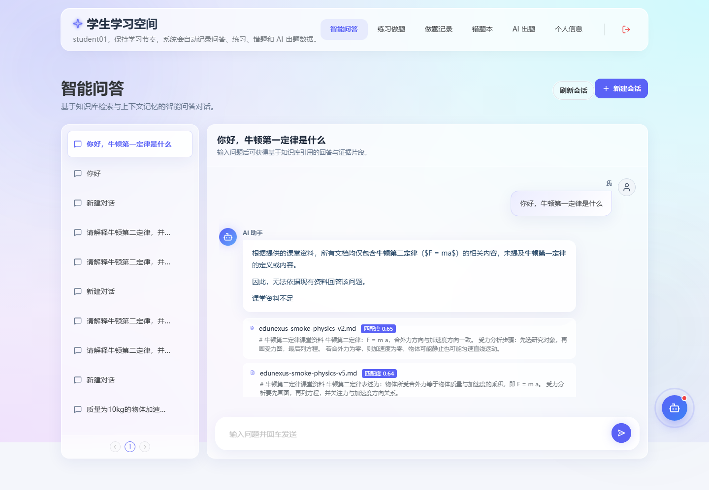
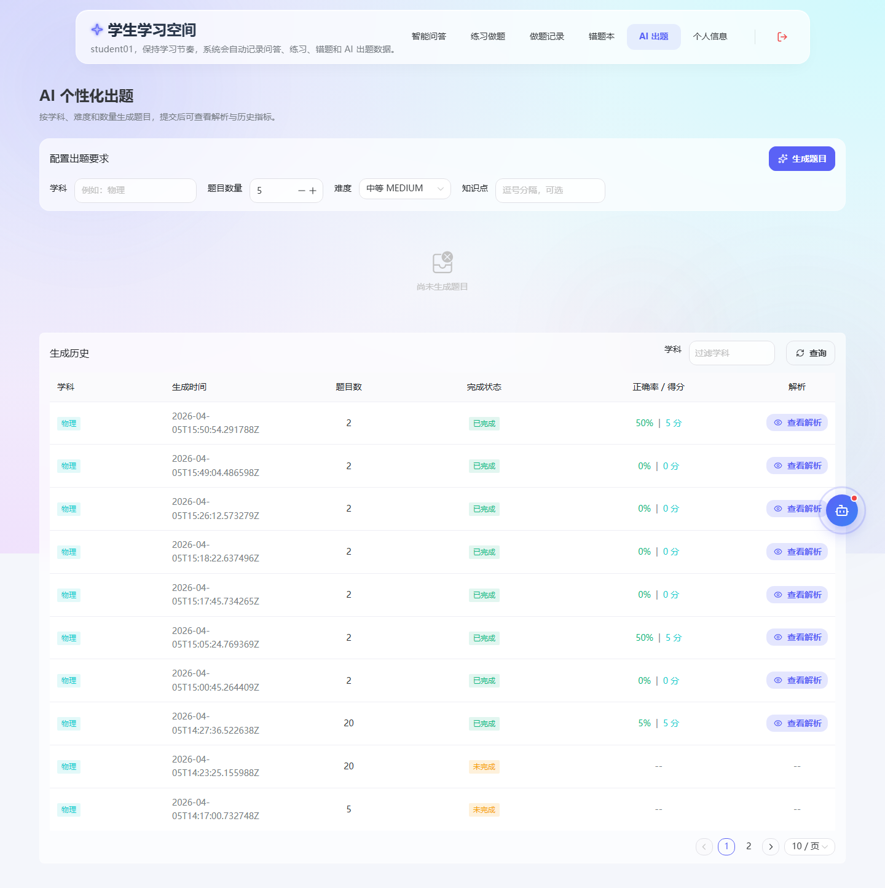
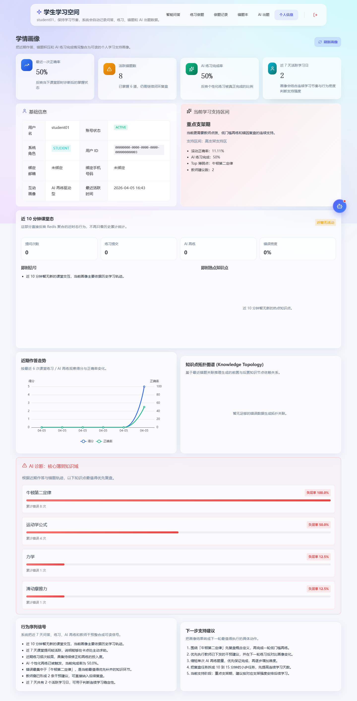
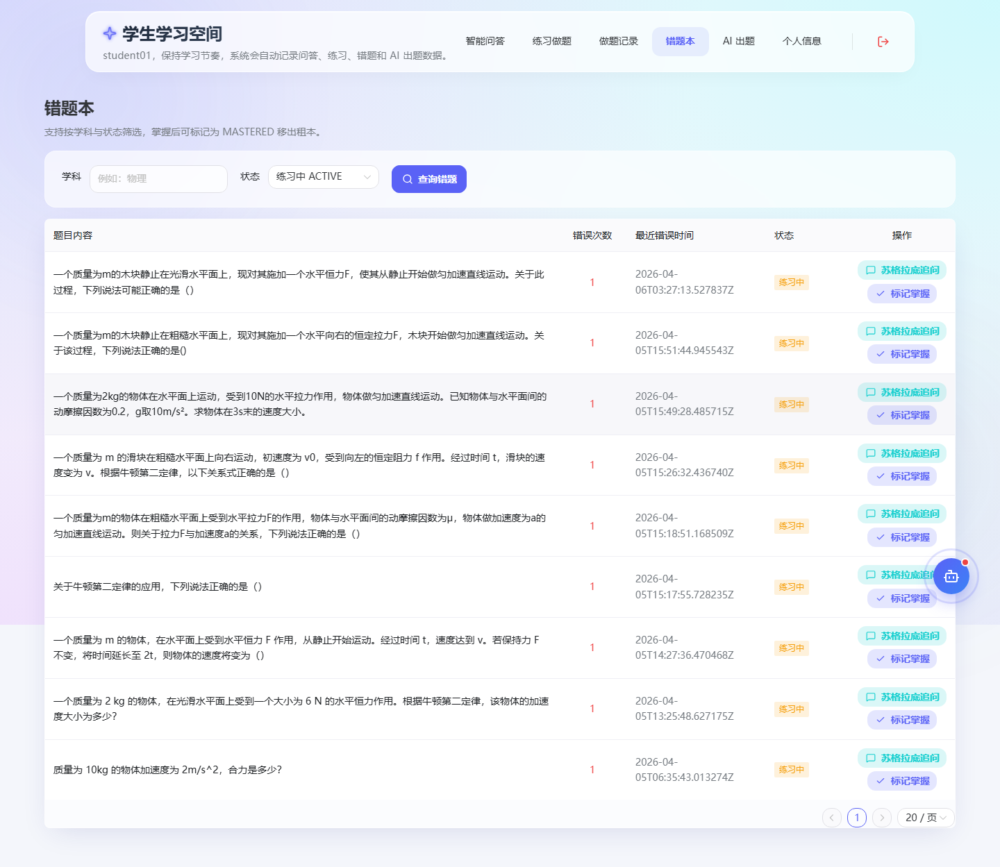
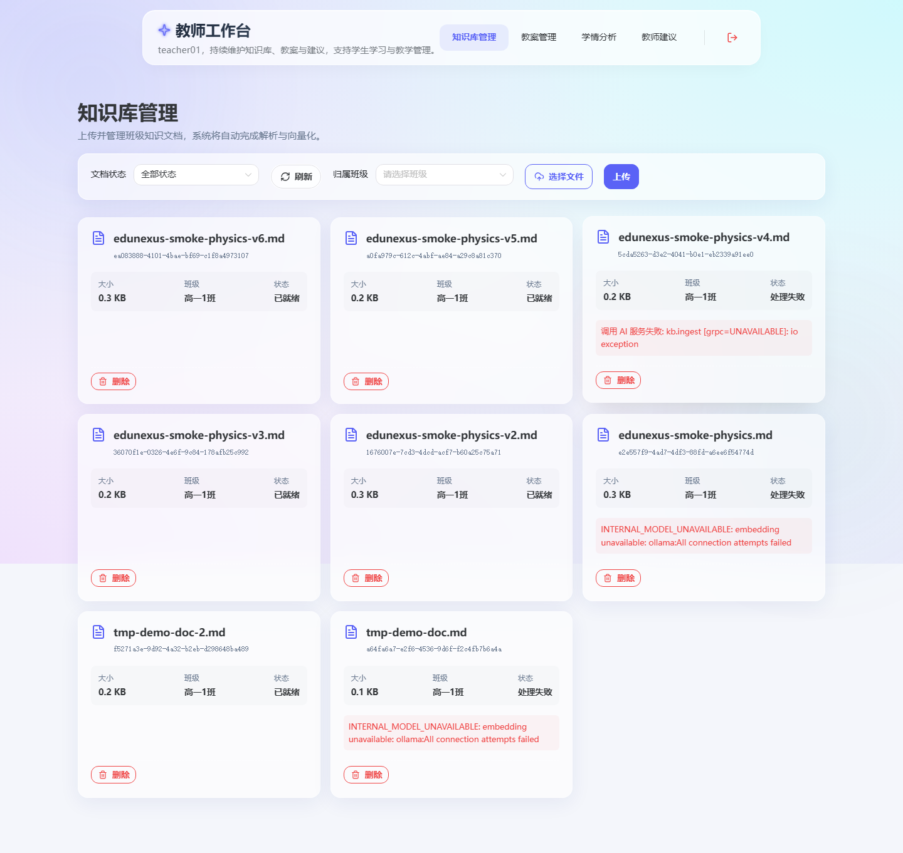
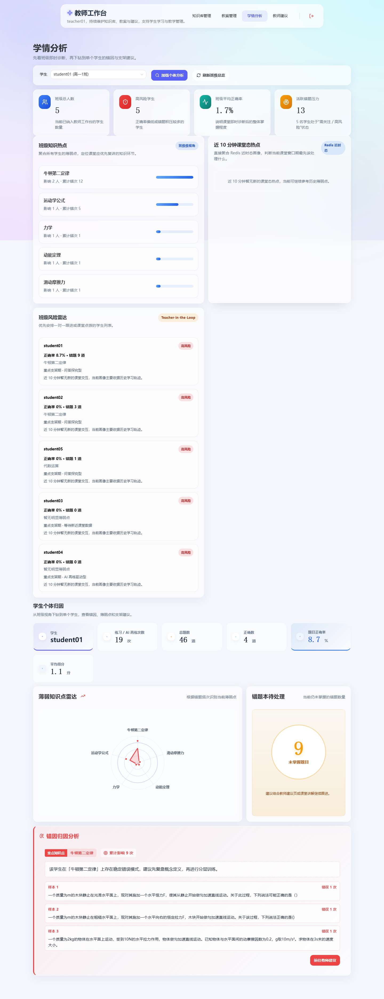
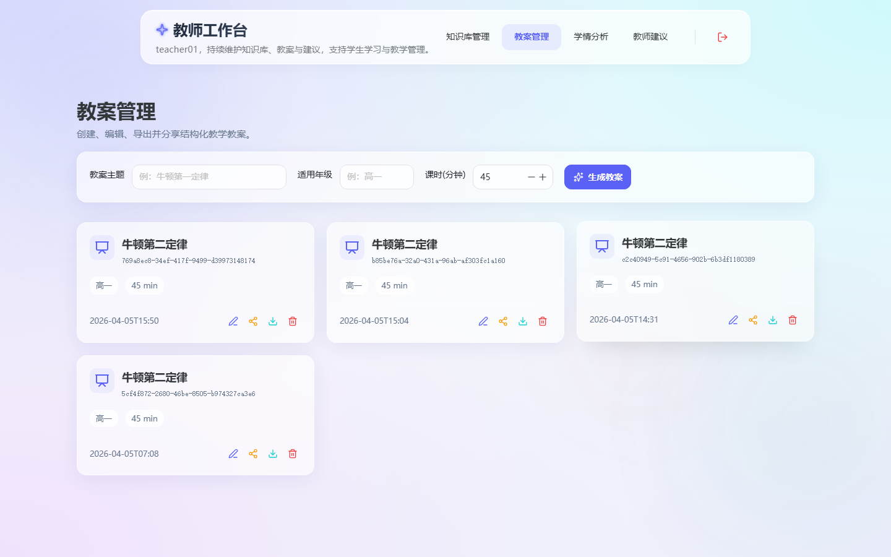
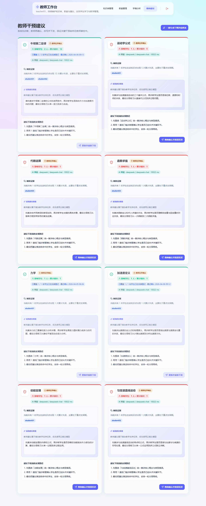
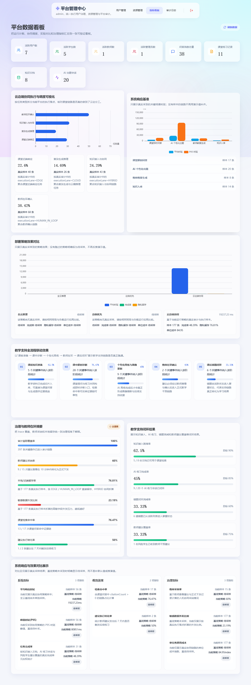
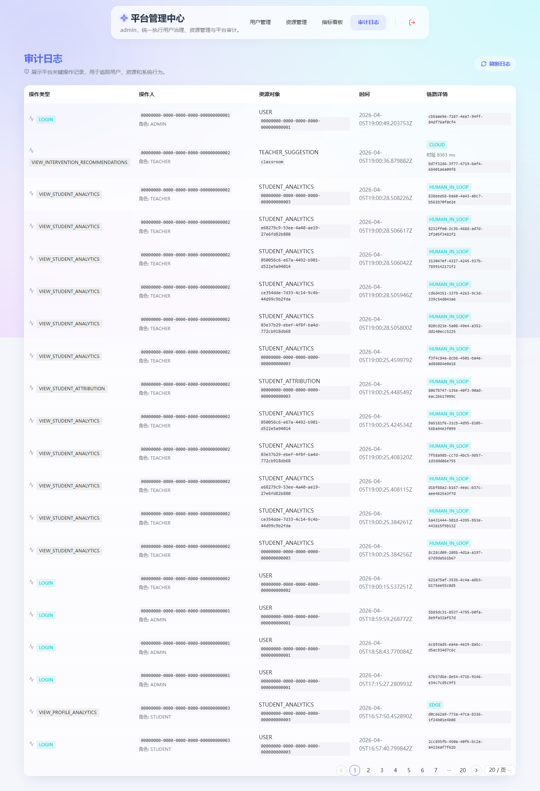

# EduNexus-AI：面向课堂即时诊断与个性化干预的智能辅学系统

[](https://github.com/hicancan/edunexus-ai)
[](https://github.com/hicancan/edunexus-ai)
[](https://github.com/hicancan/edunexus-ai)
[](https://openjdk.org/projects/jdk/21/)
[](https://www.python.org/downloads/release/python-3120/)
[](./LICENSE)

EduNexus-AI 是一套以**“课堂即时诊断与个性化干预”**为核心问题构建的实战级云边端协同智能辅学系统。它的设计理念从最初的“大模型试题生成”全面跃升为**面向学习支持的形成性评价数字中枢**。系统以服务学生认知建构、问题暴露、学习调节与教师干预为导向，全面覆盖教与学的微观过程。

## 🎓 核心教育与系统理念

本作品彻底摒弃了单纯向学生投喂资源的粗放推荐模型，转而引入了三大成熟的教育工程与规制思想：

- **Teacher-in-the-Loop（教师主导的干预机制）**：AI 只做高频分析与诊断建议下发的前置，最核心的教学路线规划与直接干预建议必须经过主责教师确认。
- **时间敏感的动态画像**：告别刻板的“高分/差生”静态属性标签，依托系统构建出对课堂内最后 10 分钟状态灵敏的“序列化学习特征”，抓住纠偏的最佳窗口期。
- **教育场景下数据分治的“云边端协同”**：强敏感度的个人识别与短交互拦截驻留在边端（Spring Boot + Redis）；而教案撰写、跨用户共度错因大模型归因则上浮至大模型核心层。

---

## 🏗️ 全局系统架构与依赖感知任务图 (DG-EduSched)

为化解云侧大模型时延无法适配课堂极速诊断以及合规性隐私的痛点，系统底层设计了独创的带约束图调度引擎，其工作流流转严格按照隔离职责划定。

```mermaid
graph TB
    %% 样式与主题定义
    classDef client fill:#e3f2fd,stroke:#1e88e5,stroke-width:2px,color:#0d47a1
    classDef api fill:#f1f8e9,stroke:#689f38,stroke-width:2px,color:#33691e
    classDef ai fill:#fff3e0,stroke:#f57c00,stroke-width:2px,color:#e65100
    classDef db fill:#f3e5f5,stroke:#8e24aa,stroke-width:2px,color:#4a148c
    classDef external fill:#eceff1,stroke:#607d8b,stroke-width:2px,color:#263238

    subgraph client_tier [🌐 统一教学工作台与端侧]
        Client["Web 交互层<br/>(Vue 3.5 / Naive UI)"]:::client
    end

    subgraph business_tier [⚙️ 核心业务与控制面 (近端/边侧主导)]
        API["Spring Boot 环境中枢<br/>(Java 21 Virtual Threads)"]:::api
    end

    subgraph ai_tier [🧠 RAG 与诊断推理层 (远/边缘混合)]
        AI["FastAPI 教育智能微服务<br/>(Python 3.12 / Qdrant)"]:::ai
    end

    subgraph infrastructure_tier [💾 泛在持久化层]
        PG[("PostgreSQL 17<br/>主业务 / 审计库")]:::db
        Redis[("Redis 7.2<br/>课堂短态时序聚集")]:::db
        MinIO[("MinIO<br/>教材讲义源物料存管")]:::db
        Qdrant[("Qdrant 1.17<br/>课件 RAG 高维向量引擎")]:::db
    end

    subgraph llm_tier [🤖 大模型算力与分析引擎]
        LLM["DeepSeek / 泛用型基座模型"]:::external
    end

    Client -- "身份与诊断交互" --> API
    API -- "业务落地与审计" --> PG
    API -- "状态驻留与缓存" --> Redis
    API -- "物理文件上载" --> MinIO
    API -- "生成式协同子任务" --> AI
    AI -- "教育资源特征抽取" --> Qdrant
    AI -- "复杂因果归纳 (DG-EduSched)" --> LLM
```

---

## 🎨 场景化截图矩阵 (Playwright 自动化生成)

### 学生侧闭环体验

学生可以直接进行基于教学范围的互动问答、自动根据个人短板重构的分层练习以及深度剖析做题错误本质的错题本等。

|                智能问答与学案辅导                |                    学生自适应答题大厅                    |
| :----------------------------------------------: | :------------------------------------------------------: |
|  |  |

|               短板诊断画像与进度面板                |                收敛于原因的系统错题本                |
| :-------------------------------------------------: | :--------------------------------------------------: |
|  |  |

### 教师侧与教务闭环

教师可在后台对自有教学主材执行 RAG 的语义知识剥离进库配置。通过即时查看全班错误聚合趋势，直接确认下发建议并一键智能生成配套教案。

|                各类格式文档与讲义入库                 |              班级薄弱项预警与状态宏观               |
| :---------------------------------------------------: | :-------------------------------------------------: |
|  |  |

|                  AI 辅助教案导出                  |                教务干预与建议人工确认流                 |
| :-----------------------------------------------: | :-----------------------------------------------------: |
|  |  |

### 高级业务治理与审计追踪

面向 IT 管理员提供全景式平台时延监控矩阵和系统数据调用审计体系，这对于合规和落地不可或缺。

|               V3.8版响应与协同控制可视化                |            合规资源流转与访问追踪底座            |
| :-----------------------------------------------------: | :----------------------------------------------: |
|  |  |

---

## 🛠 开发环境搭建与 Quick Start

### 1. 宿主机全量依赖

- **Node.js** >= 20
- **JDK** >= 21
- **Python** = 3.12 且安装 `uv` 以及 `grpcio-tools`
- **Docker & Docker Compose** （用于一键拉起 PG / Redis / MinIO / Qdrant）

### 2. 构建与运行流程

_说明：本项目核心启动脚本针对 Windows (PowerShell) 环境专门深度融合构建。_

```powershell
# 1. 准备环境变量与关键配置
cp .env.example .env

# 2. 安装全部前端与 Python 相关依赖，并生成 Prisma 类的通信 Protobuf / OpenAPI Types
./scripts/run-dev.ps1 -InstallDeps

# 3. 直接通过容器拉起底层 4 大件 (Redis/PG/MinIO/Qdrant) 并全量启动所有的 Web 与后端微服务
./scripts/run-dev.ps1 -StartUp -Wait
```

_默认访问地址:_

- 🖥️ 前端平台： `http://localhost:4174` (默认提供测试三角色内置快速填充账户)
- ⚙️ API Swagger：`http://localhost:8080/swagger-ui.html`
- 🧠 AI 服务热调试：`http://localhost:8000/docs`

---

## 🚀 进阶与格式化指令 (工程规制)

EduNexus 所有代码严守商业落地软件级别的格式化标尺，前端依赖 ESlint (Flat Config) + Prettier 联动，后端通过 Spotless 对齐 Google 格式纲要。
在推送与编译前，您可以使用下述自动化质量检测链路：

```bash
# 进入前端执行核心校验与构建
cd apps/web
npm run lint:fix        # 执行修复型静态分析代码规范
npm run format          # 从配置文件强校验并覆盖缩进规则
npm run typecheck       # Typescript 全量底层类型推导检查
npm run build           # 打包发布版，检验工程稳定性
```

---

## 📌 项目里程碑与 V3.8 版本变更纪要

本次系统自 V3.8 版本起正式成为全形态交付作品。在这个迭代中：

- 将**ECharts 图表排版自适应重叠重构**完成工业级收尾。
- 脱离死板的自动化机制，建立 `Teacher-In-The-Loop` 功能干预断点。
- 前后端对接了带 `/api/v1` 的稳定网关，重构鉴权与 Token 下发。
- E2E 功能完全由外部多角色并发 Playwright-cli 系统级驱动执行快照审计通过。

> 最终声明：项目核心交互入口、逻辑引擎、调度链路全为原生手写；大模型接入（DeepSeek，可切换 Ollama）仅在此架构下承担复杂归纳任务，整个架构体系不受单一模型锁定限制。

## 📄 授权与许可

该项目遵循 **AGPL v3** 开源协议，所有学术交流、私有化教学改革实施等行为均被许可，详见 LICENSE。
