# 🎓 EduNexus AI: 智能教育一体化工作台

[](https://github.com/hicancan/edunexus-ai)
[](https://github.com/hicancan/edunexus-ai)
[](https://openjdk.org/projects/jdk/21/)
[](https://www.python.org/downloads/release/python-3120/)
[](LICENSE)

**EduNexus AI** 是一款专为 2026 年现代智慧教育场景打造的旗舰级一体化工作台。项目采用微服务化架构理念，深度整合 **RAG (检索增强生成)** 技术，为学生、教师和管理者提供从智能辅导到全量治理的闭环体验。

---

## ✨ 核心特性展厅

### 1. 极简登录与多角色适配
项目内置基于角色 (RBAC) 的动态路由与权限拦截引擎。


### 2. 学生端：全链路智能辅助
- **智能对话 (RAG)**：基于自研切片算法的知识库精准问答。
- **题目练习与解析**：支持全科题目练习，配备由 AI 驱动的深度解析与薄弱点扫描。


### 3. 教师端：教研数字化中枢
- **知识穹顶管理**：支持 PDF/Word 异步解析与向量化。
- **学情多维追踪**：利用 ECharts 雷达图进行细粒度知识漏洞诊断。


### 4. 管理端：全域资源治理
- **数据看版**：实时观测平台活跃度与资源健康指标。
- **全合规审计**：记录全量操作日志，支持资源生命周期管理。


---

## 🏗 全景架构图

```mermaid
graph TB
    subgraph Client [用户终端层]
        Web[Vue 3 SPA - Vite]
    end

    subgraph Business [业务逻辑层]
        API[Spring Boot 3.4 - API Service]
        Auth[Spring Security + JWT]
        Job[Idempotent Job Engine]
    end

    subgraph AI [人工智能层]
        AIS[FastAPI - AI/RAG Service]
        Parse[PDF/Docx Parser]
        Embed[Vector Embedding]
        Search[Vector Search]
    end

    subgraph Infra [基础设施层]
        DB[(PostgreSQL 16)]
        Redis[(Redis 7 - Cache/Blacklist)]
        Qdrant[(Qdrant - Vector DB)]
        MinIO[(MinIO - S3 Blob Storage)]
    end

    %% Communication Flow
    Web -- "REST API (Role-Based)" --> API
    API -- "Internal REST (Service Token)" --> AIS
    API -- "JDBC" --> DB
    API -- "Jedis" --> Redis
    API -- "S3 SDK" --> MinIO
    AIS -- "HTTP" --> LLM{Local Ollama / Cloud LLM}
    AIS -- "GRPC/HTTP" --> Qdrant

    %% Shared logic
    API -- "Audit Logging" --> DB
```



---

## 🛠 技术栈与工具链

### **前端 (apps/web)**
- **核心框架**: Vue 3.5 (Composition API) + TypeScript 5
- **架构模式**: Feature-Sliced Design (FSD)
- **状态管理**: Pinia + PersistedState (持久化)
- **UI 组件库**: Naive UI + TailwindCSS
- **数据可视化**: ECharts 6 + Vue-ECharts
- **工具**: Vite (构建), Vitest (测试), Axios (请求), Zod (Schema 校验)

### **后端 (apps/api)**
- **核心框架**: Spring Boot 3.4.3 (Java 21)
- **鉴权中心**: Spring Security + Stateless JWT (含退出黑名单机制)
- **数据访问**: Spring JDBC + Flyway (数据库迁移)
- **文档处理**: Apache PDFBox + software.amazon.awssdk (S3)
- **监控/契约**: Spring Actuator + OpenAPI 3 (SpringDoc)

### **AI 服务 (apps/ai-service)**
- **核心框架**: FastAPI (Python 3.12)
- **向量引擎**: Qdrant Client
- **文档解析**: pypdf, python-docx
- **大模型支持**: Ollama (本地), DeepSeek, OpenAI, Gemini
- **环境治理**: Conda + UV (超快包管理器)

---

## 📂 项目文件架构 (Tree)

```text
edunexus-ai/
├── apps/
│   ├── ai-service/          # Python AI 服务 (RAG/解析/模型调度)
│   │   ├── ai_service/      # 核心逻辑 (routes, schemas, services)
│   │   └── pyproject.toml   # UV 环境配置
│   ├── api/                 # Java 业务后端
│   │   ├── src/main/java    # Spring Boot 源码
│   │   ├── src/main/resources/db/migration # Flyway SQL 脚本
│   │   └── pom.xml          # Maven 依赖管理
│   └── web/                 # 前端单页应用
│       ├── src/             
│       │   ├── app/         # 全局初始化与 Provider
│       │   ├── features/    # 细粒度业务特性
│       │   ├── pages/       # 各角色路由页面
│       │   └── entities/    # 业务数据实体
│       └── package.json     # 前端依赖配置
├── doc/                     # 项目文档 (契约、图片、设计稿)
│   └── picture/             # 存放 README 引用图示
├── scripts/                 # 跨平台 (PS1/SH) 自动化运维脚本
├── docker-compose.yml       # 一键部署基础设施 (PostgreSQL/Redis/Qdrant/MinIO)
└── .env.example             # 环境变量模版
```

---

## 🚀 快速上手

### 1. 环境准备
- **Docker Desktop** (包含 Compose)
- **JDK 21** & **Node.js 20+**
- **Conda** (环境名必须设定为 `edunexus-ai`)
- **uv** (推荐安装以获得极速 Python 启动体验)

### 2. 初始化与启动
```powershell
# 1. 复制环境变量
Copy-Item .env.example .env

# 2. 一键启动所有服务 (包含基础设施、API、AI 与前端)
.\scripts\run-dev.ps1
```

### 3. 默认测试信息
| 角色 | 账号 | 密码 | 初始入口 |
| :--- | :--- | :--- | :--- |
| **管理员** | `admin` | `12345678` | `/admin/users` |
| **教师端** | `teacher01` | `12345678` | `/teacher/knowledge` |
| **学生端** | `student01` | `12345678` | `/student/chat` |

---

## 📹 工作流实测演示

````carousel
### 📖 学生端：从练习到解析的全流程

<!-- slide -->
### 🏫 教师端：知识库管理与学生洞察

<!-- slide -->
### 🛠 管理端：全域资源与指标监控

````

---

## 📜 开源协议
本项目基于 **MIT License** 开源。

---

> **EduNexus AI** - 连接知识，驱动未来。
