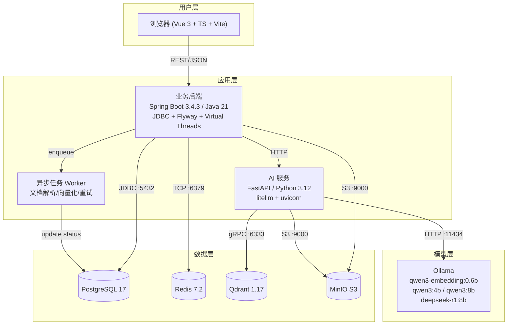

# EduNexus AI SSOT 总则（2026 高质量工程版）

## 1. 文档目标
本文件定义 EduNexus AI 的“单一事实来源（Single Source of Truth, SSOT）”治理规则。

本仓所有 AI/人工实现必须遵循：

1. 范围可以收敛，但范围内需求必须 100% 落地，不接受“伪完成”。
2. 所有实现都必须可追踪到明确需求 ID 与验收用例。
3. 任何冲突都按优先级裁决，禁止口头需求漂移。
4. 文档可直接驱动代码实现、测试生成与验收执行。

## 2. SSOT 文档清单（核心 12 + 工程增强 3）

### 2.1 核心 12 件套（业务闭环）

| 编号 | 文档 | 作用 |
|---|---|---|
| 00 | `00-SSOT-总则.md` | 定义真相源规则、优先级、变更流程 |
| 01 | `01-PRD-产品需求规格.md` | 定义业务目标、范围边界、功能需求与验收标准 |
| 02 | `02-需求追踪矩阵.md` | 建立“需求 -> 页面/API/数据/验收”映射，防漏项 |
| 03 | `03-用户流程与页面交互.md` | 规定页面、交互状态、端到端流程 |
| 04 | `04-领域模型与术语字典.md` | 统一核心概念、状态机、业务规则术语 |
| 05 | `05-数据模型与迁移规范.md` | 规范 PostgreSQL/Qdrant 数据结构与迁移策略 |
| 06 | `06-API契约-openapi.yaml` | 机器可读接口契约，前后端联调与代码生成基线 |
| 07 | `07-鉴权与权限模型.md` | 规范 JWT、RBAC、ABAC、资源归属校验 |
| 08 | `08-AI与RAG策略.md` | 规范 RAG 流水线、Prompt、模型路由、容错策略 |
| 09 | `09-配置与环境变量规范.md` | 统一 `.env`、运行时配置与环境切换 |
| 10 | `10-开发约束与代码规范.md` | 统一工程结构、编码规范、错误码与日志规范 |
| 11 | `11-验收清单与演示脚本.md` | 统一上线/答辩验收标准与演示路径 |

### 2.2 工程增强 3 件套（可交付保障）

| 编号 | 文档 | 作用 |
|---|---|---|
| 12 | `12-内部服务契约与异步任务规范.md` | API -> AI 服务内部契约、任务编排、幂等与重试 |
| 13 | `13-测试策略与质量门禁.md` | 测试金字塔、质量阈值、CI/CD 门禁 |
| 14 | `14-前端实现规范与设计系统约束.md` | 组件规范、表单校验、响应式与可访问性 |

## 2.5 系统架构全景图

## 3. 文档优先级与冲突裁决
当文档之间出现冲突时，按以下规则裁决：

1. **业务范围冲突**：以 `01-PRD` 为准。
2. **接口字段冲突**：外部 API 以 `06-API契约` 为准；内部服务调用以 `12` 为准。
3. **数据字段冲突**：以 `05-数据模型` 为准。
4. **权限/安全冲突**：以 `07-鉴权与权限模型` 为准（安全规则唯一源）。
5. **AI 行为冲突**：以 `08-AI与RAG策略` 为准。
6. **枚举/状态机冲突**：以 `04-领域模型与术语字典` 为准（枚举唯一源）。
7. **前端交互/组件实现冲突**：流程以 `03` 为准，组件与交互细则以 `14` 为准。
8. **验收是否通过**：以 `11-验收清单` + `13-质量门禁` 为准。
9. 上述规则无法裁决时，以本总则 + 需求变更记录为准。

## 4. 需求 ID 规则
所有需求必须采用统一 ID，禁止无编号需求。

- 认证：`R-AUTH-xx`
- 聊天：`R-CHAT-xx`
- 练习：`R-EX-xx`
- AI 出题：`R-AIQ-xx`
- 教师：`R-TCH-xx`
- 管理：`R-ADM-xx`
- 平台/非功能：`R-PLT-xx`

任何代码、接口、表结构、页面行为、测试用例必须至少映射到一个需求 ID。

## 5. MVP 不妥协原则
MVP 定义为“范围有限、完成度不打折”。

- 允许不做：原生移动端 App、复杂多租户计费、企业级多活容灾。
- 不允许不做：本期范围内任一核心链路（注册登录、聊天、做题、错题、AI 出题、教师知识库、教案、管理看板）。
- 不允许使用静态假数据替代业务主链路（除非在 `11` 明确标注为演示降级）。

## 6. 变更管理流程
需求变更必须走最小流程，不允许口头直接改代码：

1. 在 `01` 新增或修改需求 ID。
2. 在 `02` 同步映射（页面/API/数据/验收）。
3. 若涉及外部接口，更新 `06`；若涉及内部服务契约，更新 `12`。
4. 若涉及数据结构，更新 `05`。
5. 若涉及权限/安全，更新 `07`。
6. 若涉及 AI 行为，更新 `08`。
7. 若涉及前端交互与组件规范，更新 `03/14`。
8. 同步更新 `11/13` 的验收与质量门禁。

## 7. 版本策略

- 文档版本采用 `major.minor.patch`。
- `major`：范围或核心架构变化。
- `minor`：新增需求、接口、数据结构或验收条目。
- `patch`：错字修复、阈值微调、描述补全。

## 8. Definition of Done（DoD）

DoD 的完整定义见 `11-验收清单与演示脚本.md` 与 `13-测试策略与质量门禁.md`。

摘要：一个需求 ID 仅在 `02` 映射完整、`06/12` 契约可调用、`05` 数据已落地、`07` 权限通过、`11/13` 验收与门禁通过后才可标记完成。

## 9. AI 代码生成执行规则

1. AI 生成代码时，仅可使用当前 `doc/` 清单作为真相源，不得引用仓库外或历史废弃文档。
2. 文档缺失时不得臆测核心行为，必须先补文档再实现。
3. 所有生成代码必须可回溯到 `需求ID + API + 表结构 + 验收用例`。

## 10. Python 运行环境强约束

1. AI 服务与所有 Python 任务**必须**运行在 Conda 环境 `edunexus-ai`（不是其它任何环境名）。
2. AI 服务与所有 Python 任务**必须**通过 `uv` 执行（`uv sync` / `uv run`），禁止 `pip install` 与 `python xxx.py` 直跑。
3. CI/本地脚本必须显式校验 `CONDA_DEFAULT_ENV == edunexus-ai`，不满足时直接失败。

## 11. 架构决策记录（ADR）

| 编号 | 决策 | 理由 | 日期 |
|---|---|---|---|
| ADR-001 | PostgreSQL 17 而非 MySQL | JSONB 原生支持、丰富索引类型、开源无许可限制 | 2026-02 |
| ADR-002 | Qdrant 而非 Milvus/Pinecone | gRPC 性能好、payload 过滤强、Docker 部署简单 | 2026-02 |
| ADR-003 | FastAPI 独立 AI 服务而非 Spring Boot 统一 | Python ML 生态更强，服务可独立扩缩容 | 2026-02 |
| ADR-004 | Ollama 作为本地推理引擎 | Windows 原生支持、OpenAI 兼容 API、模型管理简单 | 2026-02 |
| ADR-005 | Monorepo（apps/web + api + ai-service） | 项目规模适配、共享文档与基础设施、CI 简化 | 2026-02 |
| ADR-006 | litellm 而非 LangChain | 路由轻量、可控性更高、避免过重抽象 | 2026-02 |
| ADR-007 | Python 强制 `edunexus-ai` + `uv` 执行 | 依赖隔离、可复现、统一执行入口、降低环境漂移 | 2026-02 |

---
文档状态：`v1.3.0`（2026-02-27：Python 运行约束升级为“edunexus-ai + uv”强制规则）
