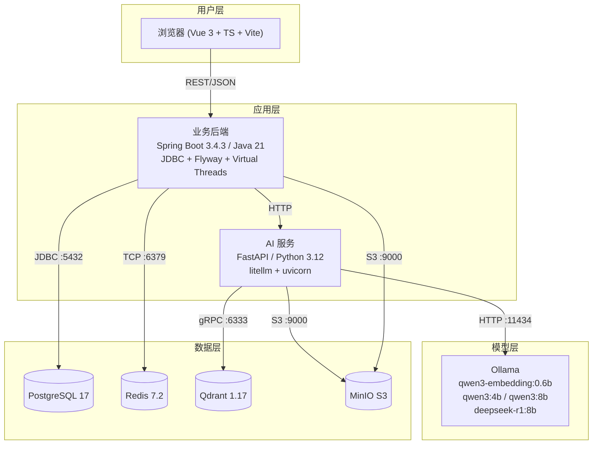

# EduNexus AI SSOT 总则（MVP 不妥协版）

## 1. 文档目标
本文件定义 EduNexus AI 的“单一事实来源（Single Source of Truth, SSOT）”治理规则。

目标只有一个：

1. MVP 可以缩范围，但范围内需求必须 100% 落地，不接受“伪完成”。
2. 所有实现都必须可追踪到明确需求 ID。
3. 任何冲突都能按规则快速裁决，避免口头需求漂移。

## 2. SSOT 文档清单（12 件套）

| 编号 | 文档 | 作用 |
|---|---|---|
| 00 | `00-SSOT-总则.md` | 定义真相源规则、优先级、变更流程 |
| 01 | `01-PRD-产品需求规格.md` | 定义业务目标、范围边界、功能需求与验收标准 |
| 02 | `02-需求追踪矩阵.md` | 建立“需求 -> 页面/API/数据/验收”映射，防漏项 |
| 03 | `03-用户流程与页面交互.md` | 规定页面、交互状态、端到端流程 |
| 04 | `04-领域模型与术语字典.md` | 统一核心概念、状态机、业务规则术语 |
| 05 | `05-数据模型与迁移规范.md` | 规范 PostgreSQL/Qdrant 数据结构与迁移策略 |
| 06 | `06-API契约-openapi.yaml` | 机器可读接口契约，前后端/AI 服务联调基线 |
| 07 | `07-鉴权与权限模型.md` | 规范 JWT、RBAC、资源归属校验 |
| 08 | `08-AI与RAG策略.md` | 规范 RAG 流水线、Prompt、模型路由、容错策略 |
| 09 | `09-配置与环境变量规范.md` | 统一 `.env` 语义、必填项、环境切换 |
| 10 | `10-开发约束与代码规范.md` | 统一工程结构、编码规范、错误码与日志规范 |
| 11 | `11-验收清单与演示脚本.md` | 统一上线/答辩验收标准与演示路径 |

## 2.5 系统架构全景图

## 3. 文档优先级与冲突裁决
当文档之间出现冲突时，按以下规则裁决：

1. **业务范围冲突**：以 `01-PRD` 为准。
2. **接口字段冲突**：以 `06-API契约` 为准。
3. **数据字段冲突**：以 `05-数据模型` 为准。
4. **权限/安全冲突**：以 `07-鉴权与权限模型` 为准（安全规则唯一源）。
5. **AI 行为冲突**：以 `08-AI与RAG策略` 为准。
6. **枚举/状态机冲突**：以 `04-领域模型与术语字典` 为准（枚举唯一源）。
7. **验收是否通过**：以 `11-验收清单` 为准（DoD 唯一源）。
8. 上述规则无法裁决时，以本总则 + 需求变更记录为准。

## 4. 需求 ID 规则
所有需求必须采用统一 ID，禁止无编号需求。

- 认证：`R-AUTH-xx`
- 聊天：`R-CHAT-xx`
- 练习：`R-EX-xx`
- AI 出题：`R-AIQ-xx`
- 教师：`R-TCH-xx`
- 管理：`R-ADM-xx`
- 平台/非功能：`R-PLT-xx`

任何代码、接口、表结构、页面行为必须至少映射到一个需求 ID。

## 5. MVP 不妥协原则
MVP 定义为“范围有限、完成度不打折”。

- 允许不做：移动端 App、复杂多租户计费、企业级多活容灾。
- 不允许不做：本期范围内任一核心链路（注册登录、聊天、做题、错题、AI 出题、教师知识库、教案、管理看板）。
- 不允许用“静态假数据”替代业务主链路（除非在 `11` 验收文档中明确标注为演示降级策略）。

## 6. 变更管理流程
需求变更必须走最小流程，不允许口头直接改代码：

1. 在 `01` 新增或修改需求 ID。
2. 在 `02` 同步映射（页面/API/数据/验收）。
3. 若涉及接口，更新 `06`。
4. 若涉及数据结构，更新 `05`。
5. 若涉及 AI 行为，更新 `08`。
6. 更新 `11` 的验收用例。

## 7. 版本策略

- 文档版本采用 `major.minor.patch`。
- `major`：范围或核心架构变化。
- `minor`：新增需求或新增接口。
- `patch`：错字修复、阈值微调、描述补全。

## 8. Definition of Done（DoD）

DoD 的完整定义见 `11-验收清单与演示脚本.md`。

摘要：一个需求 ID 仅在 `02` 映射完整、`06` 接口可调用、`05` 数据已落地、`07` 权限通过、`11` 验收用例通过后才可标记完成。

## 9. 架构决策记录（ADR）

| 编号 | 决策 | 理由 | 日期 |
|---|---|---|---|
| ADR-001 | PostgreSQL 17 而非 MySQL | JSONB 原生支持、丰富的索引类型、开源无许可限制 | 2026-02 |
| ADR-002 | Qdrant 而非 Milvus/Pinecone | gRPC 性能好、payload 过滤强、Docker 部署简单、无云厂商锁定 | 2026-02 |
| ADR-003 | FastAPI 独立 AI 服务而非 Spring Boot 统一 | Python ML 生态远优于 Java（litellm/numpy/pypdf 等），独立服务可独立扩缩容 | 2026-02 |
| ADR-004 | Ollama 作为本地推理引擎 | Windows 原生支持、OpenAI 兼容 API、自动 GPU 管理、模型管理极简 | 2026-02 |
| ADR-005 | Monorepo（apps/web + api + ai-service） | 项目规模适合单仓、共享 doc/docker-compose、CI 简单 | 2026-02 |
| ADR-006 | litellm 而非 LangChain | litellm 仅做 LLM 路由（轻量），LangChain 全链路封装（过重）；本项目 RAG 手写更可控 | 2026-02 |

---
文档状态：`v1.1.0`（2026-02-26 新增架构图 + ADR + 引用拓扑优化）
