# EduNexus AI 页面截图总览

本文档使用本地运行中的 `http://127.0.0.1:5173`，通过 MCP `chrome-devtools` 对当前前端全部 18 个页面进行截图，并统一展示在此。

截图时间：2026-03-07  
截图目录：`doc/picture/readme`

## 公共页面

### 登录页 `/login`

### 注册页 `/register`

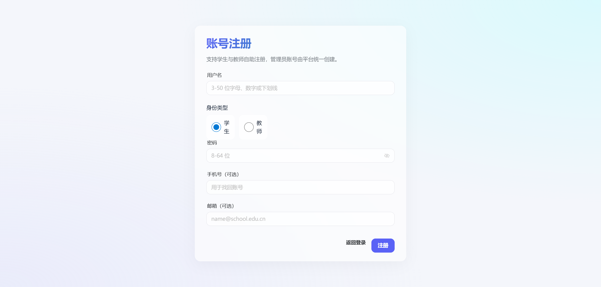

### 无权限页 `/403`

### 未找到页 `/404`

## 学生工作区

测试账号：`student01 / 12345678`

### 智能问答 `/student/chat`

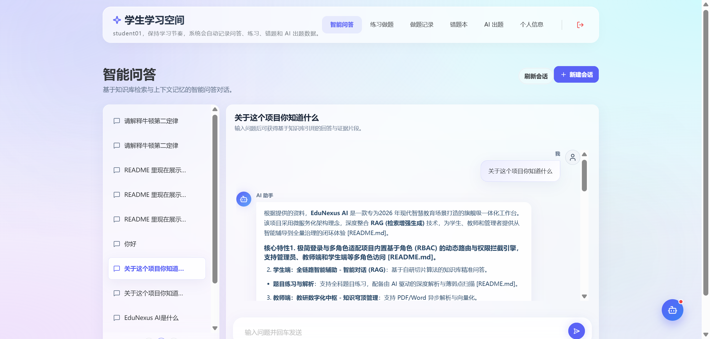

### 题目练习 `/student/exercise`

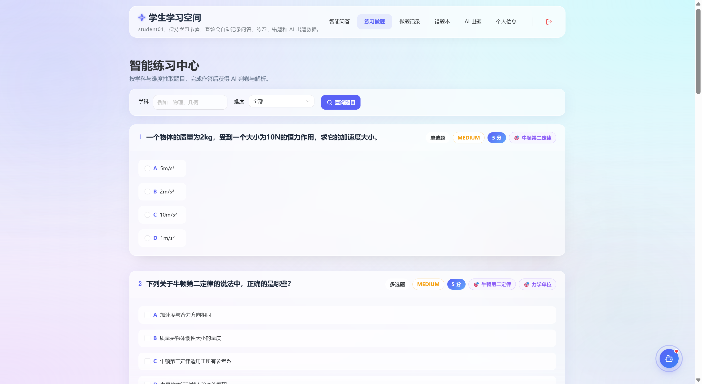

### 做题记录 `/student/exercise/records`

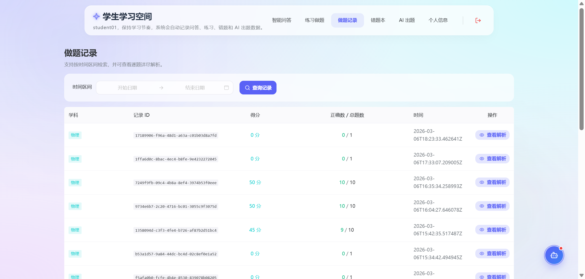

### 错题本 `/student/wrong-book`

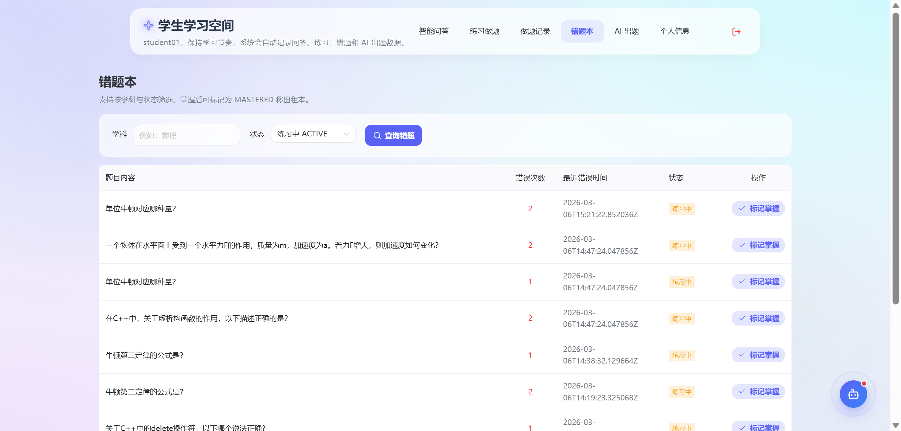

### AI 出题 `/student/ai-questions`

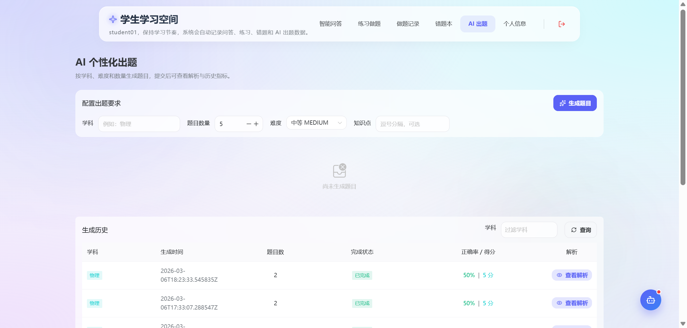

### 个人资料 `/student/profile`

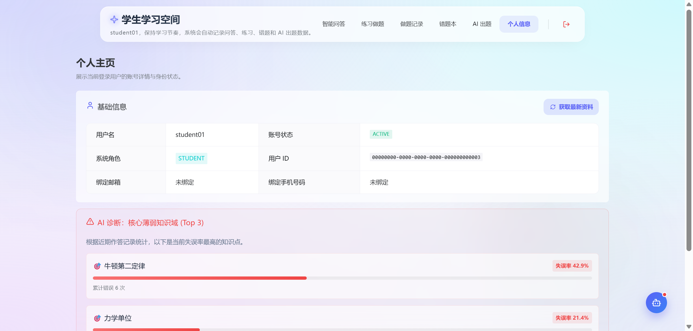

## 教师工作区

测试账号：`teacher01 / 12345678`

### 知识库管理 `/teacher/knowledge`

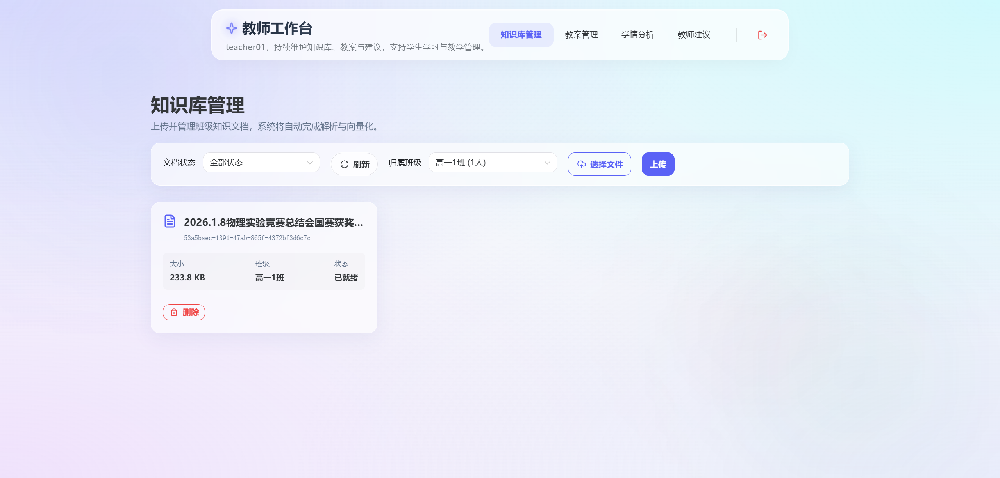

### 教案管理 `/teacher/plans`

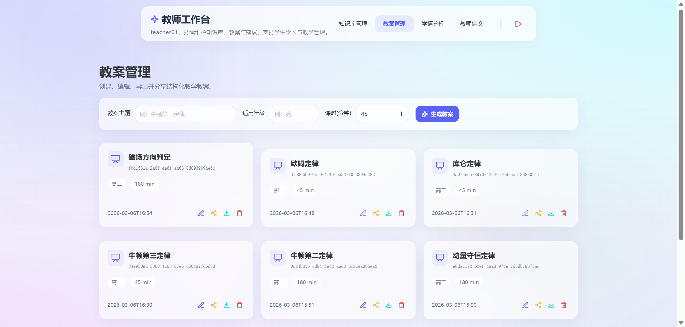

### 学情分析 `/teacher/analytics`

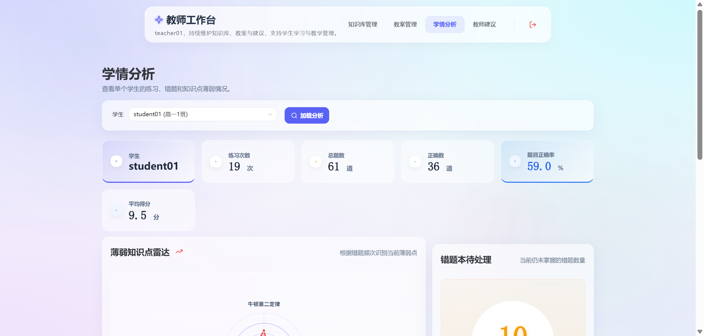

### 教师建议 `/teacher/suggestions`

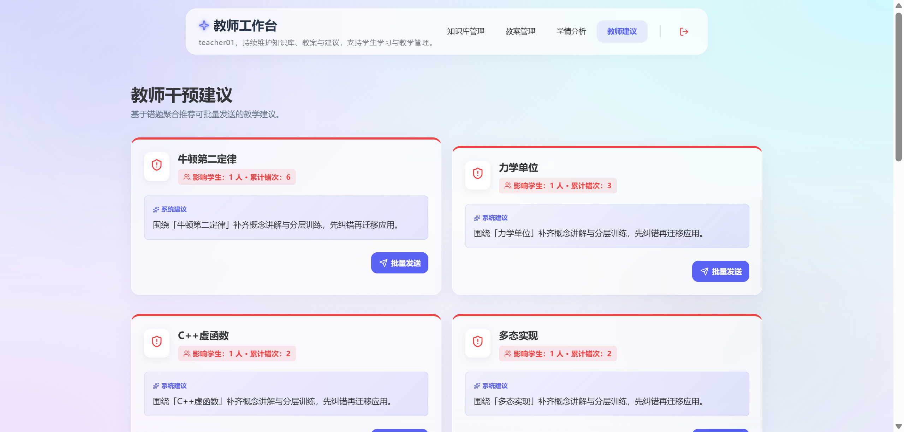

## 管理员工作区

测试账号：`admin / 12345678`

### 用户管理 `/admin/users`

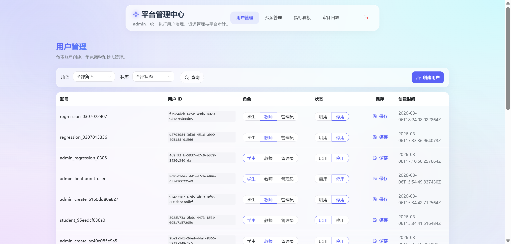

### 资源管理 `/admin/resources`

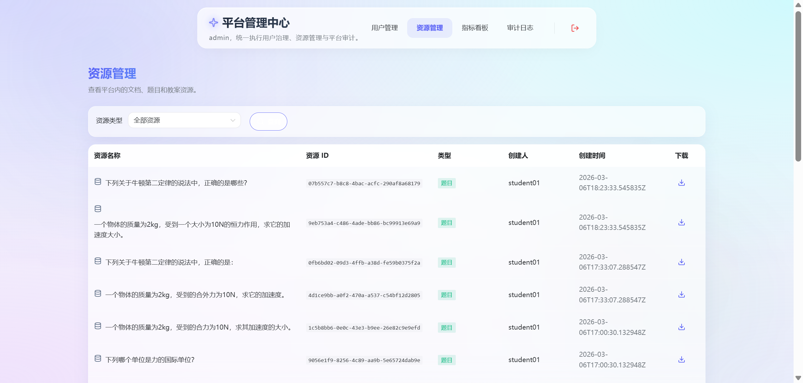

### 数据看板 `/admin/dashboard`

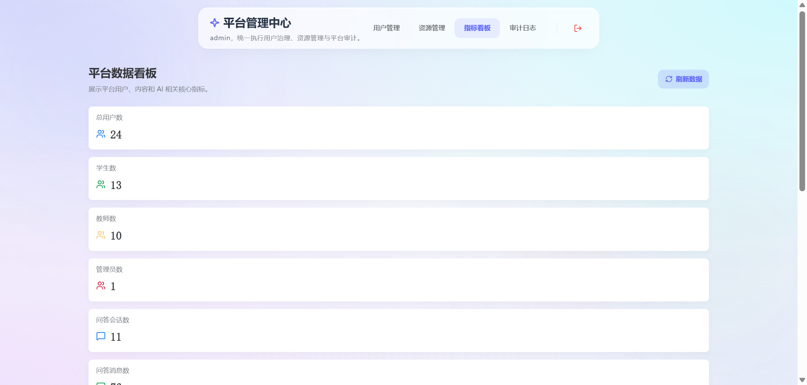

### 审计日志 `/admin/audits`

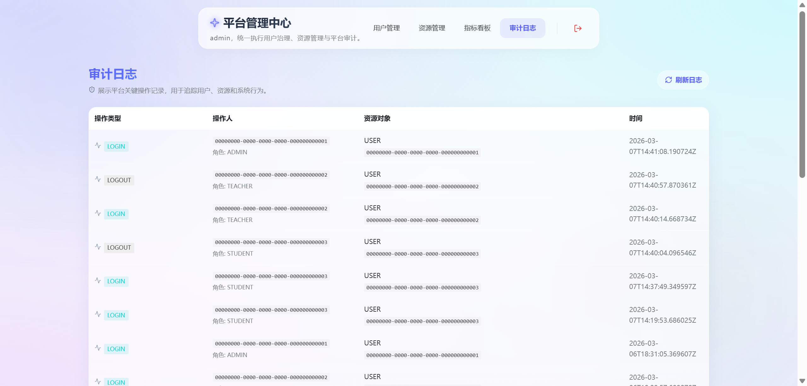
